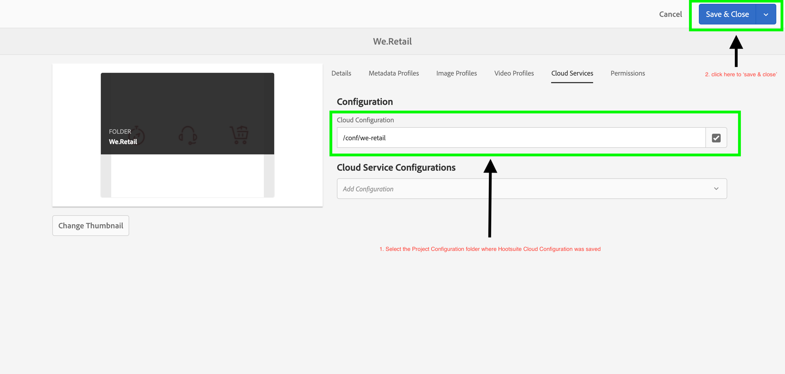
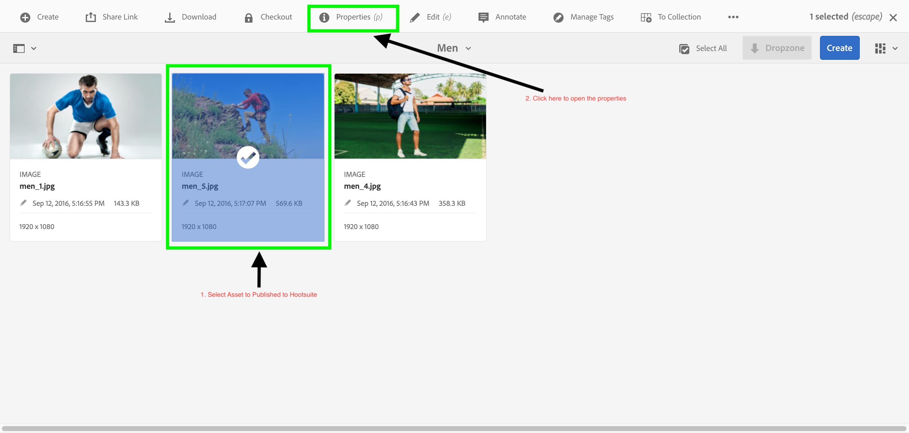
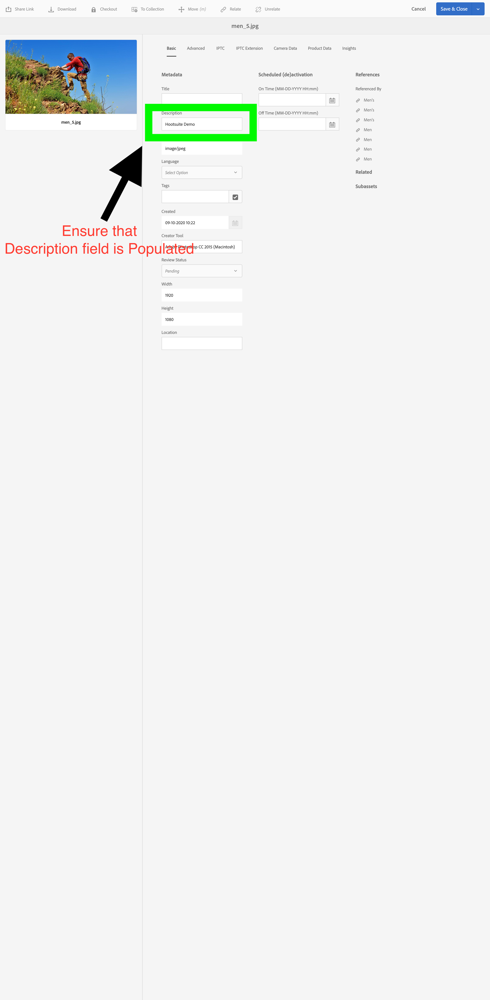
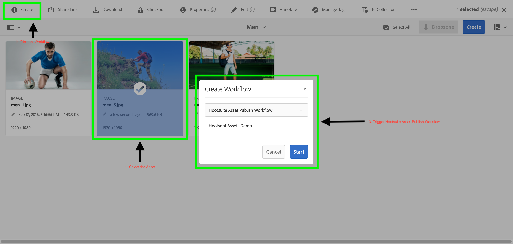

# AEM - Experience Fragment Configuration Setup

## Setup &Demo

+ Add Cloud Service on Assets folder.

+ Select an asset, to be published to hootsuite. The Selected asset should have data in "Description" property as Hootsuite doesn't allow Social Media Posts without text content. In case description field is blank, please enter data in description field. Save and close.

+ Publish the Asset to hootsuite using the workflow. Assets in Adobe Experience Manager can be published using the following workflow(s):
  **Asset Publish Workflow: /conf/global/settings/workflow/models/hootsuite-xf-publish-workflow**

* **[Main Content](../README.md)**
* **[Hootsuite Setup](./HOOTSUITE_SETP.md)**
* **[AEM Cloudservice Setup](./AEM_CLOUDSERVICES_SETUP.md)**
* **[AEM XF Setup](./AEM_XF_SETUP.md)**