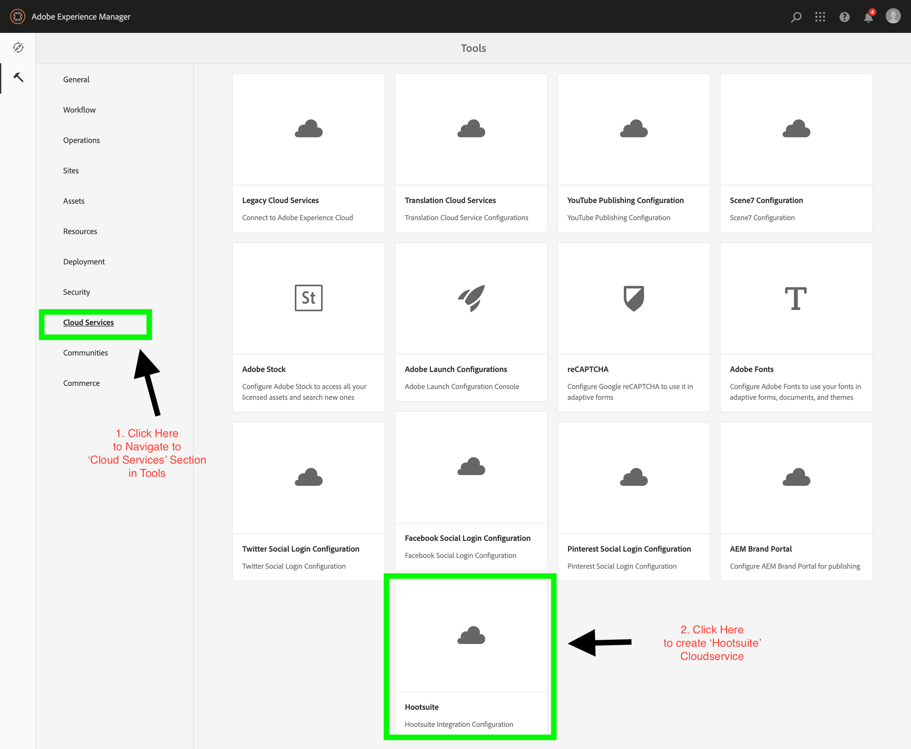
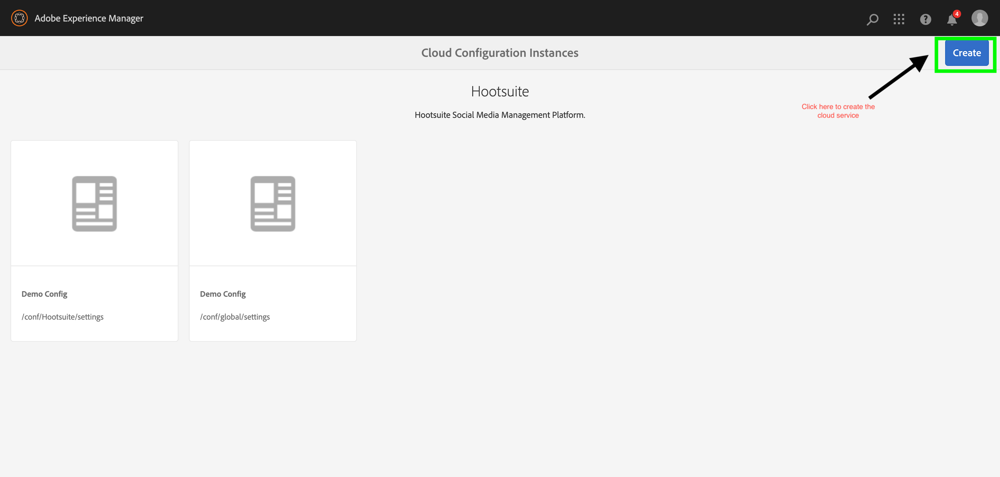
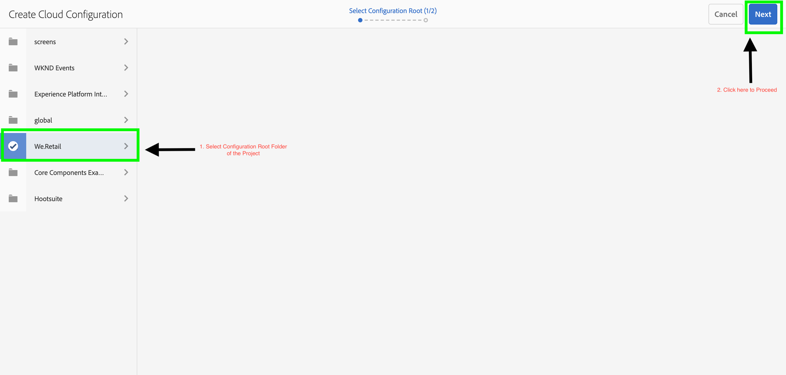
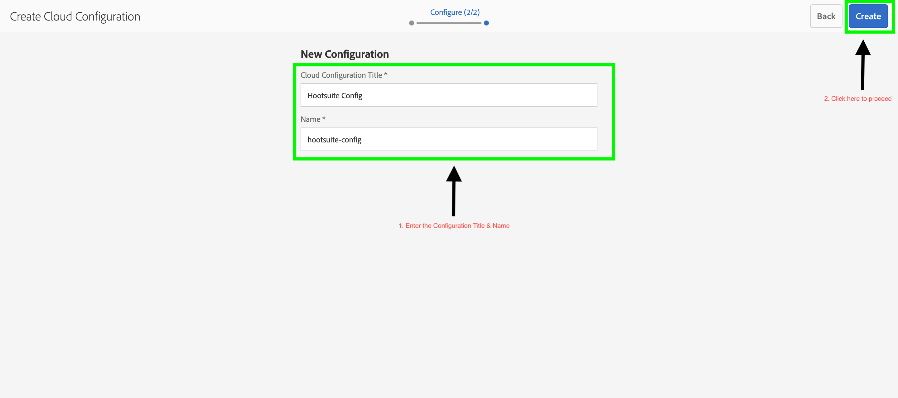
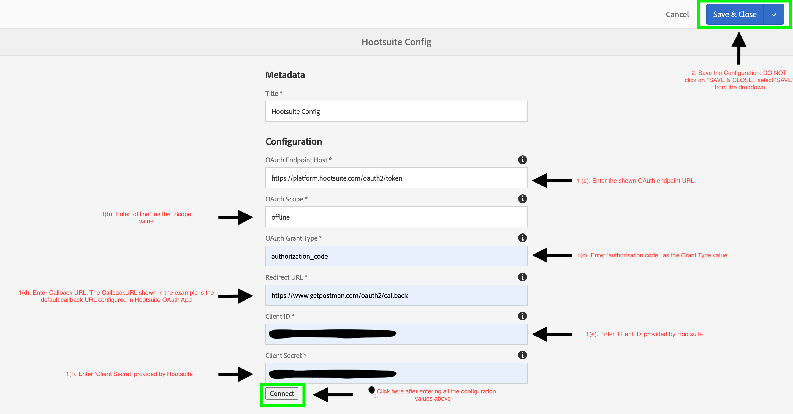
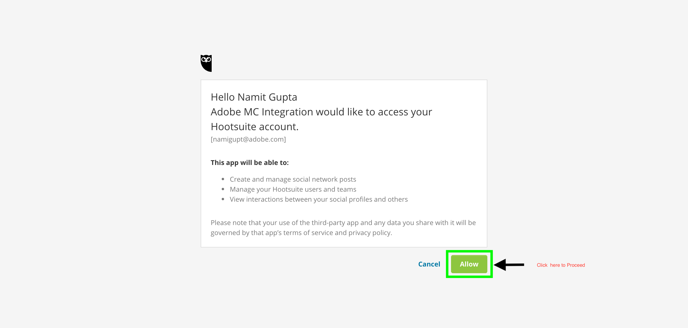

# AEM - CloudServices Setup

* Navigate to **Tools -> Cloud Services -> Hootsuite**

+ Create a new Cloud Service configuration. Enter the details as:

+ **Title**: Title of your configuration e.g. Hootsuite Integration

+ **OAuth Endpoint Host**: Configure the OAuth Endpoint - https://platform.hootsuite.com/oauth2/token
+ **OAuth Scope**: Enter the OAuth Scope - offline
+ **OAuth Grant Type** : Enter the grant type - authorization_code
+ **Redirect URL**: Enter the Redirect callback URL - Same as configured in Hootsuite Integration App.
+ **Client ID**: Your Hootsuite OAuth App Client ID.
+ **Client Secret**: Your Hootsuite OAuth App Client Secret.
+ Click on "Connect" button - This would estable connectivity between AEM and Hootsuite using the aforesaid integration credentials.

+ Click on 'Allow' button on the Hootsuite consent screen.

+ Upon clicking the 'Allow' button on the consent screen, the user would be redirected to the default callback URL - **https://www.getpostman.com/oauth2/callback**. It is advisable to get the correct redirect URL configured i.e. <AEM_AUTHOR_HOST>/bin/services/authorize. However, in case the default callback url is configured, user/admin is advised to modify and hit the call back url in the browser from **https://www.getpostman.com/oauth2/callback?code=<VALUE>&scope=offline&state=<VALUE>** to 
**<AEM_AUTHOR_HOST>/bin/services/authorize?code=<VALUE>&scope=offline&state=<VALUE>**. Please ensure that query parameters in the URL are not changed. If the user/admin sees a white screen, it implies that connection has been established successfully. Please report any exceptions or errors, if encountered, on this screen.
+ Finally, Save and close the configuration.

* **[Main Content](../README.md)**
* **[Hootsuite Setup](./HOOTSUITE_SETP.md)**
* **[AEM XF Setup](./AEM_XF_SETUP.md)**
* **[AEM Assets Setup](./AEM_ASSETS_SETUP.md)**