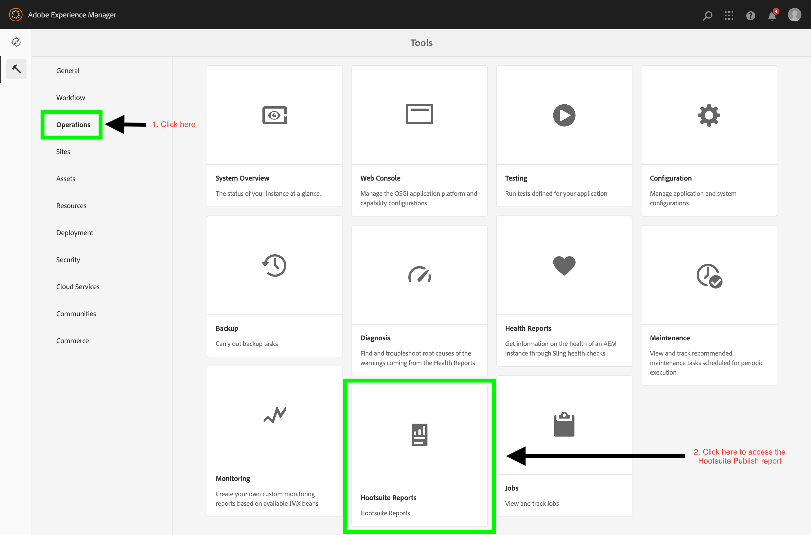
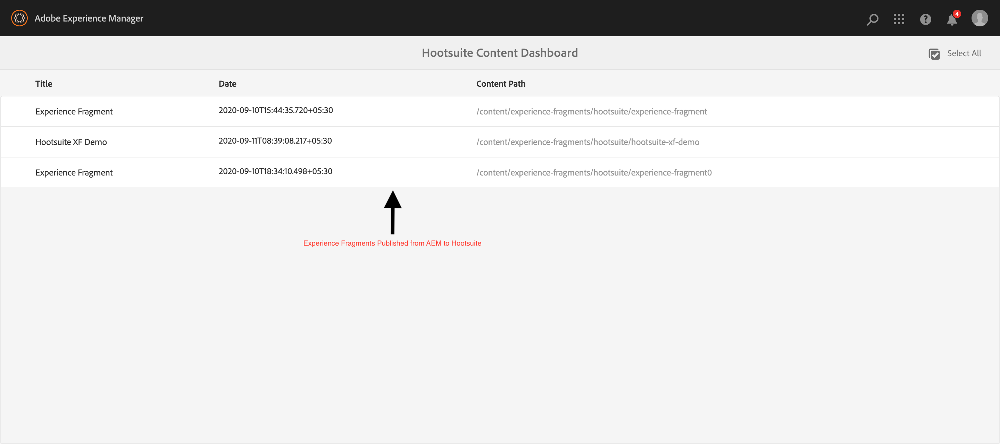

# AEM - Reporting Dasgboard

This integration module facilitates basic reporting feature. All Experience Fragments Published to Hootsuite shall be listed on the reporting dashboard.

* **[Main Content](../README.md)**
* **[Hootsuite Setup](./HOOTSUITE_SETUP.md)**
* **[AEM Cloudservice Setup](./AEM_CLOUDSERVICES_SETUP.md)**
* **[AEM XF Setup](./AEM_XF_SETUP.md)**
* **[AEM Assets Setup](./AEM_ASSETS_SETUP.md)**
