# AEM - Experience Fragment Configuration Setup

## Pre-requisites

Out of the box, this integration supports publishing Experience Fragments and Assets to Hootsuite. As an Example, following Experience Fragment template(s), which supports Hootsuite Integration, has been provided for user reference
+ /conf/Hootsuite/settings/wcm/templates/hootsuite-xf-template

Also, a set of following components have been developed to enable the authors to create content which can published to social media platforms via hootsuite
+ Text Component - Text Component available on the aforesaid template has be authored on the XF. XF's without text component shall not be published on Hootsuite as it mandatorily requires text in the social media post. Also, please ensure that only one text component is authored on the page.
+ Image component - Image component is optional.Authors may add multiple image components on the experience fragment. This integration has been tested with upto 5 images.

In case, new components are to be included on the Experience Fragment, those are required to be configured in an [OSGi configuration](http://localhost:4502/system/console/configMgr/com.adobe.core.hootsuite.integration.internal.services.MessageServiceImpl) in the format: <RESOURCE_TYPE>|<CONTENT_TYPE_IMAGE_TEXT>|<PROPERTY_NAME> e.g. 
+ hootsuite/components/content/image|asset|fileReference
+ hootsuite/components/content/text|text|text

## Setup & Demo

+ Add Cloud Service on Experience Fragment folder.
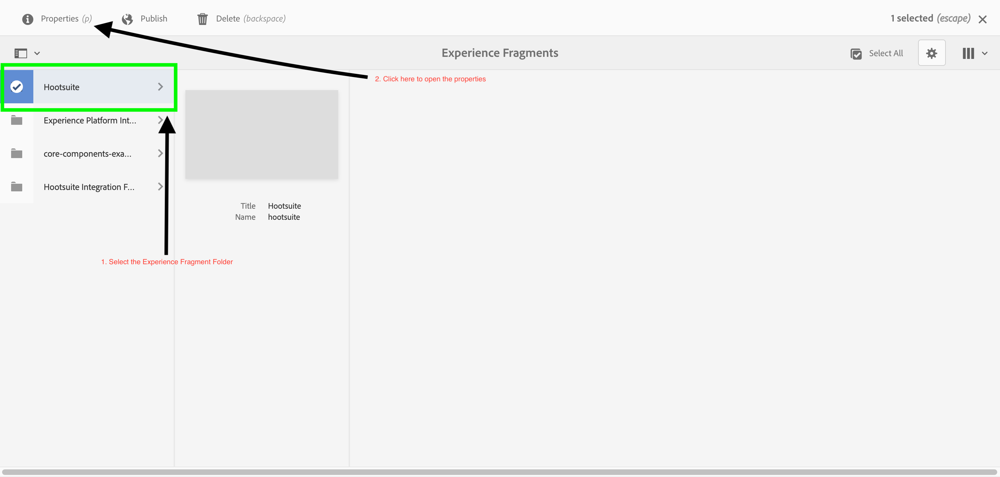
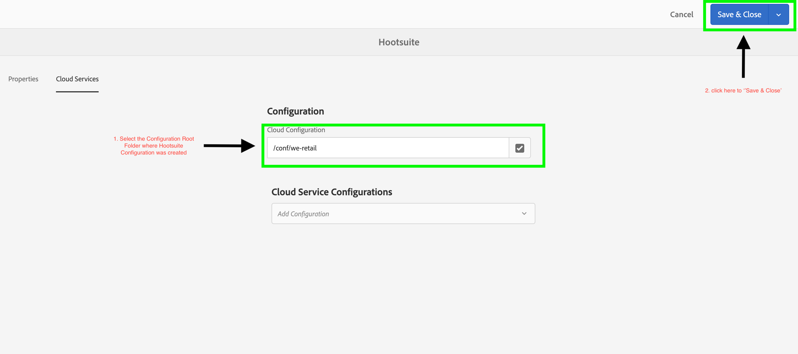

+ Create Content Fragment.
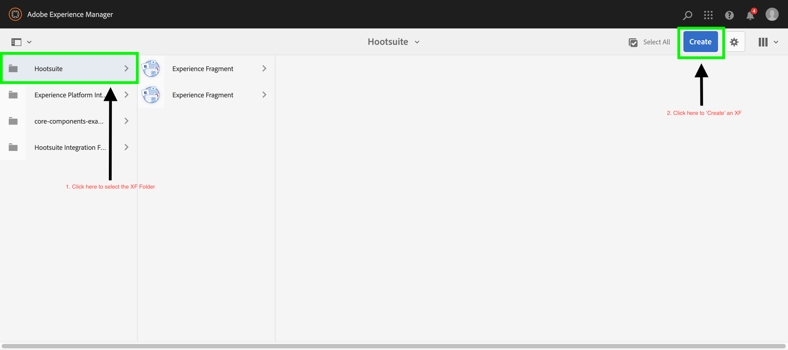
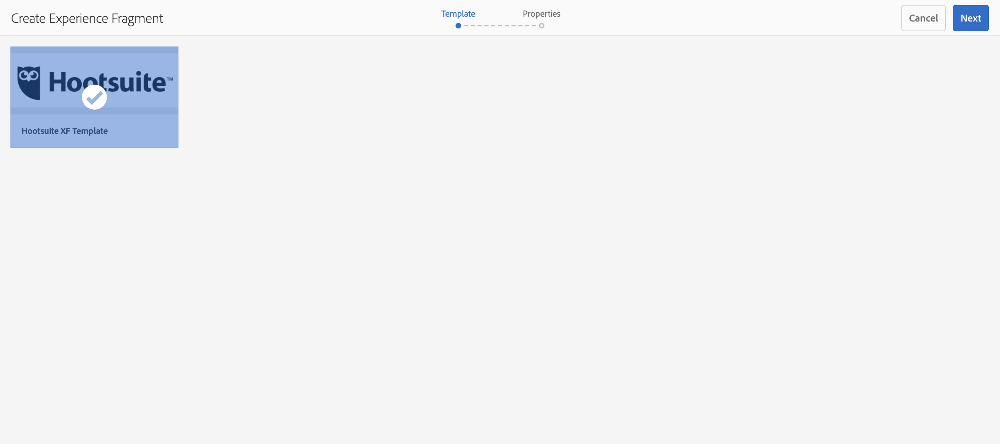
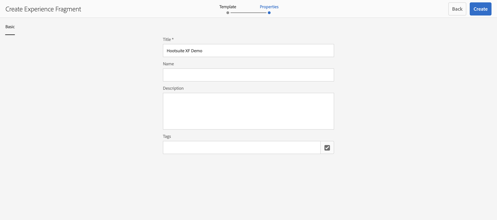

+ Author variation in Content Fragment.
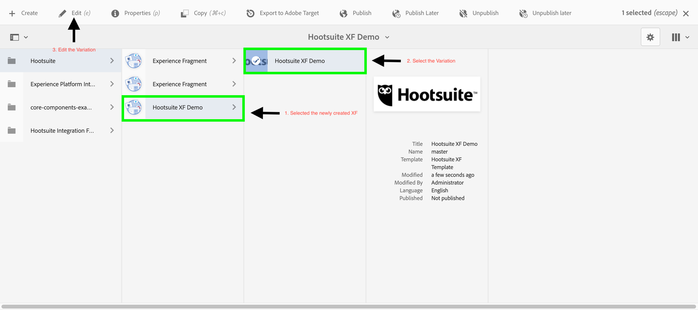
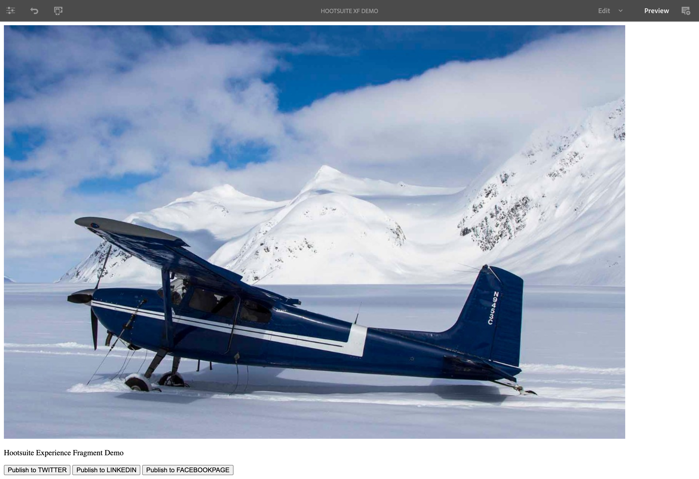

+ Publish the content using the individual Buttons i.e. Social Media platforms.
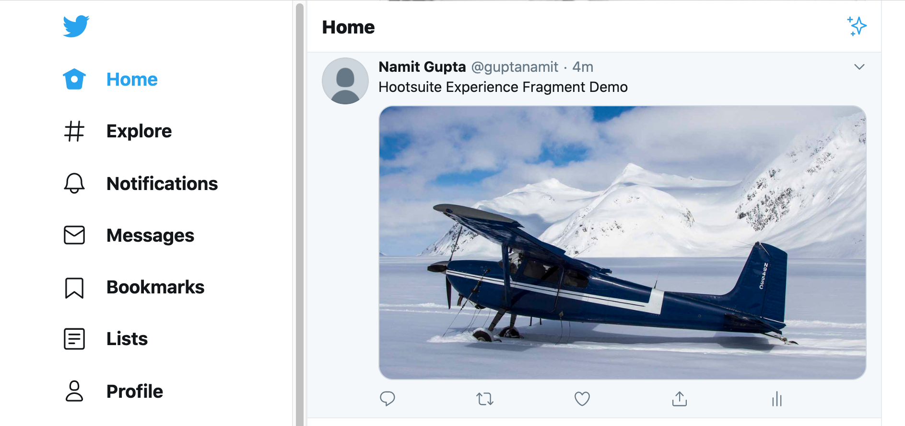
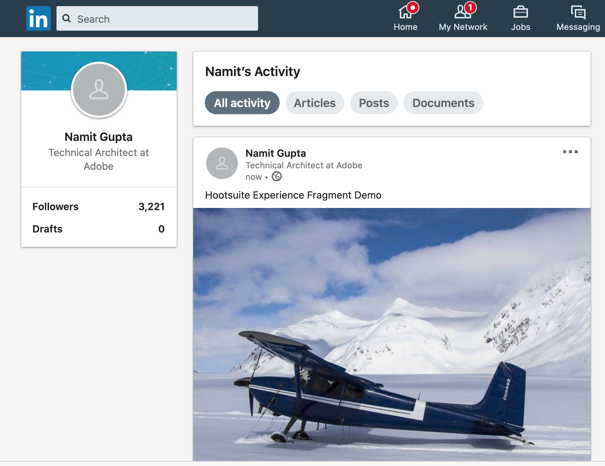
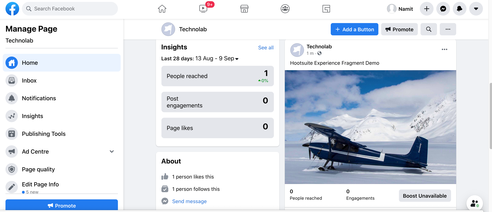

+ Publish the Experience Fragment in one go to all the linked social media platforms. Content authored as Experience Fragments or Assets in Adobe Experience Manager can be published using the following workflow(s):

* **Experience Fragment Publish Workflow**: /conf/global/settings/workflow/models/hootsuite-asset-publish-workflow
  
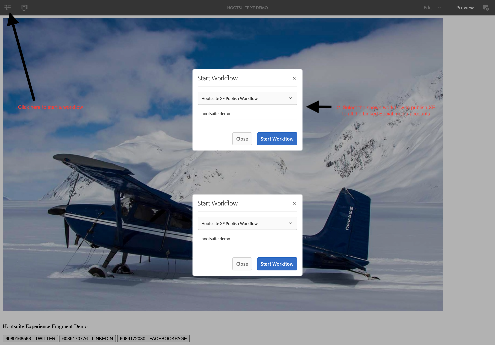

* **[Main Content](../README.md)**
* **[Hootsuite Setup](./HOOTSUITE_SETUP.md)**
* **[AEM Cloudservice Setup](./AEM_CLOUDSERVICES_SETUP.md)**
* **[AEM Assets Setup](./AEM_ASSETS_SETUP.md)**
* **[AEM Reporting Dashboard](./AEM_OPERATIONS_DASHBOARD.md)**